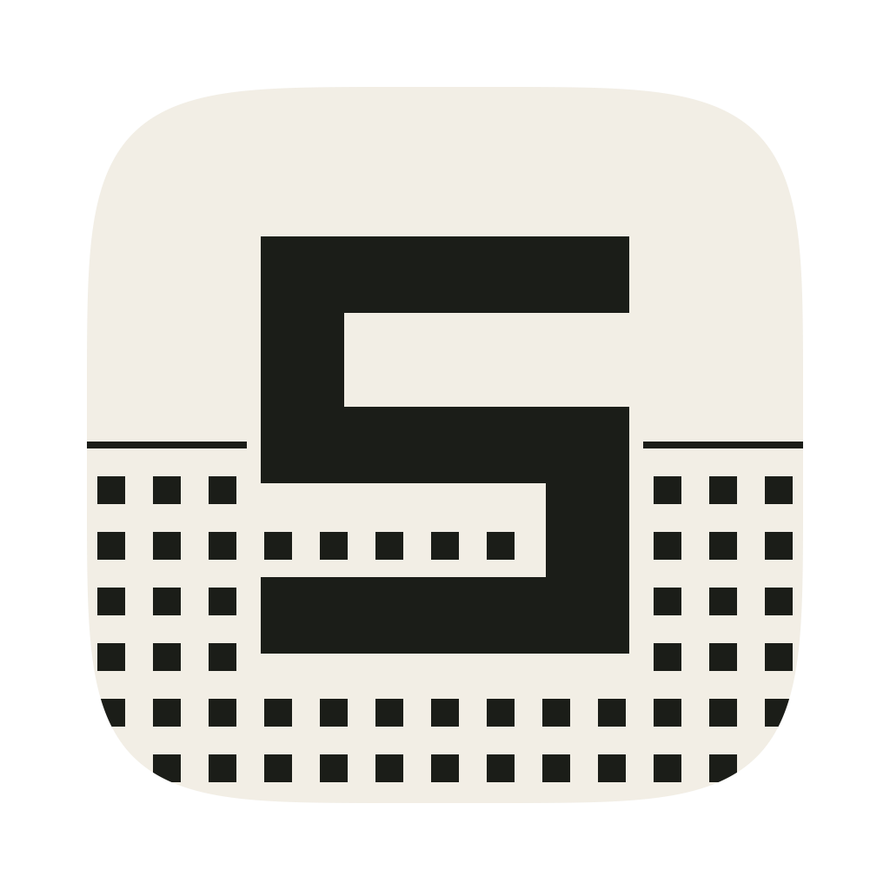

# Searoom

Quiet, local telemetry for Macs under load.

[Website](https://searoom.app) · [GitHub](https://github.com/emaitchess/searoom)

Searoom is a lightweight native macOS menu bar app made for checking an Apple
Silicon Mac while running local LLMs. It uses one low-frequency sampler, draws
its interface directly with AppKit, and keeps its bounded trend history on the
Mac.



## Status

Searoom is an early open-source build. CPU, memory, memory compression, swap,
network, disk throughput and capacity, uptime, process impact, battery and macOS
thermal-state collection are functional. Direct temperature, fan, GPU utilization
and GPU working-set memory are best-effort because Apple does not provide stable
universal public APIs for these values; unsupported sensors are shown as
unavailable.

## Metrics

- RAM working set, available memory, cache, compressed memory, swap usage, swap I/O and memory pressure
- CPU utilization, load average and derived CPU saturation pressure
- Best-effort CPU/package temperature and macOS thermal pressure
- Network download/upload throughput
- Best-effort GPU utilization, working-set memory and derived GPU pressure
- Best-effort fan RPM
- Disk read/write throughput and remaining capacity
- How long the current overall pressure level has been held
- Uptime, process count, battery level, power source and Low Power Mode
- Searoom's own CPU and resident-memory usage
- Bounded dithered trend graphs for load-bearing metrics

The menu bar can show Balanced, Searoom (free RAM and swap), Pressure, LLM,
Compute, Network, Disk I/O, Swap Activity, Thermal, Power or icon-only telemetry.
Text presets use AppKit's natural status-item width while reserving compact,
fixed character columns only for changing values. Transitions such as `8%` to
`10%` therefore do not shift neighboring menu-bar items or leave a full
worst-case-width container around the text. Every text preset begins with a
fixed-size semantic state dot: green for nominal, amber for busy, orange for
constrained, red for critical, and gray while telemetry is unavailable. The dot
uses the combined system pressure state and does not change the text column
width. Individual metric groups use the same semantic colors for their own
pressure, while active network and disk traffic use the non-alarm cool color and
idle traffic is subdued. Compact `·` separators carry no surrounding spaces so
multiple metrics remain glanceable without occupying unnecessary menu-bar
width. Minimal mode retains the Searoom mark instead. A user-recorded global
shortcut toggles the dashboard without requiring Accessibility or Input
Monitoring permission.

Custom mode provides up to three ordered metric slots and defaults to CPU usage,
RAM used and temperature. Its compact metric list includes pressure states,
separate or combined RAM free/used values, swap, network and disk directions,
GPU and GPU memory, disk free, fan, power, uptime, and Searoom's own CPU and
memory. Duplicate choices are collapsed and choosing `None` can reduce the
display to one or two metrics. Changing the custom layout recalculates the
natural text width; sampling updates reuse the selected metrics' stable value
columns.

The dashboard footer provides equal-width shortcuts to Settings, the system
Activity Monitor, and Quit.
Searoom's own CPU, RAM and sample cadence appear in one compact final telemetry
line immediately above that footer. The dashboard scrolls vertically without
visible scrollbars and suppresses horizontal movement entirely. Clicking a
byte, temperature, or throughput metric rotates its display units; paired
network, disk, and swap-throughput readings rotate together.

## Design

Searoom is a research-vessel instrument panel crossed with early Macintosh UI:
paper, ink, restrained pressure colours, Departure Mono, and deterministic Bayer
dithering. Dither patterns are cached and redrawn only when a sample changes.
Reduce Motion and light/dark system appearances are respected.

The typeface is [Departure Mono](https://departuremono.com/) by Helena Zhang,
bundled under the SIL Open Font License. The visual direction was inspired by
[Dither Kit](https://www.tripwire.sh/dither-kit); Searoom contains its own native
dither renderer and no Dither Kit code or dependency.

The complete visual system and component guidance live in [DESIGN.md](DESIGN.md),
using the open `design.md` format so contributors and design tools share the same
source of truth.

The app icon's shared PNG, SVG and ICNS geometry is generated by
`Scripts/render-icon.swift`. Generation stages every format before publishing,
so a conversion failure cannot leave the checked-in formats out of sync.

## Install

Download `Searoom.dmg` from the
[latest release](https://github.com/emaitchess/searoom/releases/latest), open it,
and drag Searoom to Applications.

Install it there rather than running it from `~/Downloads`. macOS runs a
quarantined app from a randomised read-only path, which makes launch-at-login
registration unreliable. `Searoom.zip` is also published for scripted installs.

Releases are signed with a Developer ID certificate and notarized by Apple, so
the app opens with a normal double-click rather than a Gatekeeper warning. Verify
that yourself before trusting it:

```sh
spctl --assess --type execute --verbose=4 /Applications/Searoom.app
# accepted
# source=Notarized Developer ID
```

Searoom never installs updates itself and never checks on its own schedule.
Choosing Check for Updates from its menu fetches a small version manifest from
searoom.app and offers to open the releases page; nothing else reaches the
network. Homebrew can also do the upgrade for you, and watching this
repository's releases works too.

## Build

Requirements: macOS 14+, Swift 6, and the macOS command-line developer tools.

The website for [searoom.app](https://searoom.app) is maintained in its own
repository and is not part of this one.

For day-to-day development, build and run the debug executable directly. It
stays attached to the terminal and stops with `Ctrl-C`; no app bundle is needed:

```sh
Scripts/run-dev.sh
```

This mode supports the menu-bar UI, metrics, local history and global shortcut.
Launch at login must be tested with a packaged app because `SMAppService` needs
an application bundle. On its first packaged launch, Searoom asks once whether
it should open automatically at login; the choice can be changed later in
Settings. Development-mode launches do not show this prompt.

To build manually instead:

```sh
git clone https://github.com/emaitchess/searoom.git
cd searoom
swift build --disable-sandbox
.build/debug/Searoom
```

To package an ad-hoc signed app:

```sh
Scripts/build-app.sh
open dist/Searoom.app
```

For Developer ID signing, set `CODE_SIGN_IDENTITY` before running the packaging
script. `Scripts/notarize.sh` submits an already signed build using a notarytool
keychain profile.

`Scripts/release.sh` runs the whole sequence in one step, producing a signed,
notarized, stapled `dist/Searoom.zip` that Gatekeeper accepts without a prompt:

```sh
cp .env.release.example .env.release   # fill in the identity and profile name
Scripts/release.sh                     # build and notarize
Scripts/release.sh --publish           # also tag and create the GitHub release
```

## Test

```sh
swift test --disable-sandbox
.build/debug/Searoom --self-test
```

The self-test is intentionally independent of a test framework so collectors can
also be checked on minimal command-line-tools installations.

For a local diagnostic sample without opening the UI:

```sh
.build/debug/Searoom --dump-sample
```

## Storage and privacy

Searoom contains no analytics, no account system, no crash uploader, and nothing
that reaches the network on its own schedule. The one exception is the Check for
Updates menu item: choosing it requests
[`searoom.app/latest.json`](https://searoom.app/latest.json), compares that
version with the running one, and offers to open the releases page in your
browser. It sends nothing describing your Mac, and it downloads and installs
nothing. Settings use `UserDefaults`. Trend samples are written atomically, at
most once per minute, to:

```text
~/Library/Application Support/Searoom/history.plist
```

The selected trend window bounds in-memory and on-disk history.
Settings includes a confirmed Reset Trend History action that removes these
samples without changing preferences, shortcuts or launch-at-login state.

## Metric semantics and limitations

- **Memory used** is the active, wired and compressed working set. Available
  includes reclaimable cached pages, so it intentionally differs from a simple
  `total - free-page-count` calculation and may differ slightly from Activity
  Monitor.
- **Memory pressure** uses the macOS system pressure level when available and a
  working-set ratio for its trend value.
- **Swap I/O** is the byte rate derived from deltas of Mach swap-in and swap-out
  page counters. Its first sample is zero because it establishes the baseline.
- **Compressed memory** is the macOS compressor's share of the working set and is
  already counted inside memory used. Compression and decompression rates are
  byte rates from deltas of Mach page counters; their first sample is zero.
- **CPU pressure** is not macOS PSI. It is a documented saturation signal: the
  greater of CPU utilization and one-minute load average normalized by active
  logical CPUs.
- **GPU pressure** is derived, not an Apple pressure API: the greater of
  best-effort GPU utilization and the ratio of in-use GPU system memory to the
  Metal-recommended working-set size. In-use memory is a read-only IORegistry
  value bounded by physical memory; the working-set budget comes from the public
  Metal API. Without a supported utilization key both utilization and pressure
  are unavailable.
- **Disk capacity** reads the root volume, which shares its APFS container with
  the Data volume. Available space excludes purgeable files. Remaining capacity
  is a neutral reading, not a pressure signal.
- **Sustained pressure** reports how long the current overall pressure level has
  been held, bounded by the retained history window. A `+` suffix means the run
  spans every retained sample, so the window rather than the Mac limits the
  figure.
- **Low Power Mode** is the current system power state reported by
  `ProcessInfo`; macOS may reduce CPU and GPU performance while it is enabled.
- **Network throughput** aggregates active non-loopback interfaces; VPN or other
  virtual interfaces can make aggregate traffic differ from a physical-link view.
- **Temperature, fan and GPU sensors** use read-only, best-effort SMC/IORegistry
  access. Availability and key names vary by Mac and macOS release. No privileged
  helper or subprocess fallback is used.
- **Temperature source** is CPU/package SMC data when a supported key exists;
  otherwise Searoom shows the AppleSmartBattery pack sensor and labels it `BAT`.
  AppleSmartBattery registry values expressed in hundredths of a degree Celsius
  are normalized before display.

## License

Searoom is available under the [MIT License](LICENSE). See
[third-party notices](THIRD_PARTY_NOTICES.md) for Departure Mono licensing.

Visit [searoom.app](https://searoom.app) for the project website. Source, issues,
and releases live in the
[Searoom GitHub repository](https://github.com/emaitchess/searoom).
